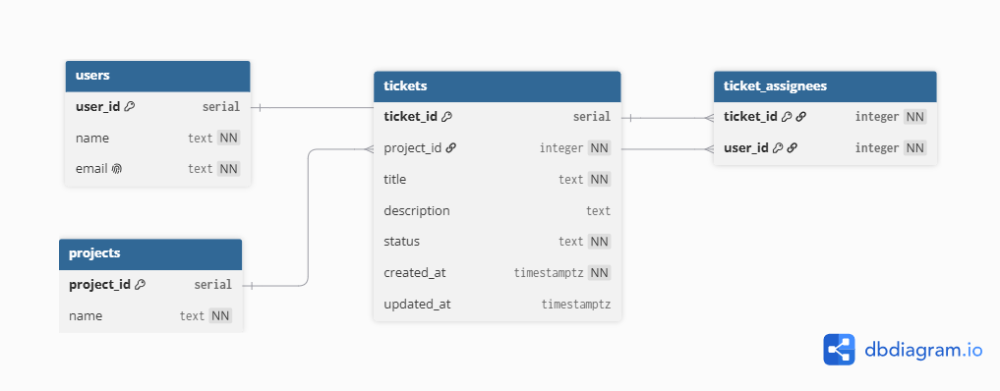

# API Design document

# 1. Database diagram
ER diagram of the schema: tables, columns (with types), primary and foreign keys, and the relationships between them.

# 2. Endpoint summary

| Method | Path | Description |
| --- | --- | --- |
| POST | /api/users | Create a new user |
| PUT | /api/users/{id} | Update an existing user |
| DELETE | /api/users/{id} | Delete a user |
| GET | /api/users | List all users |
| GET | /api/users/{id} | Get a single user |
| GET | /api/projects | List all projects (with per-status counts) |
| POST | /api/tickets | Create a new ticket |
| PUT | /api/tickets/{id} | Update a ticket |
| POST | /api/tickets/{id}/assignees | Add an assignee |
| DELETE | /api/tickets/{id}/assignees/{userId} | Remove an assignee |
| GET | /api/tickets/{id} | Get a single ticket |
| GET | /api/tickets?search=...&status=... | Search tickets |

# 3. Endpoint description
### POST /api/users
Create a new user

| Endpoint | /api/users |
| --- | --- |
| Method | POST |
| Request body | {     "name": "string",     "email": "string" } |
| Response body | {   "id": "integer",   "name": "string",   "email": "string"  } |
| Validations | The request must contain email and name fields. Email should have ‘@’ sign somewhere in the string. Name should be at least 3 characters long There is no other user with the same email. |

### PUT /api/users/{id}
Update an existing user

| Endpoint | /api/users/{id} |
| --- | --- |
| Method | PUT |
| Request body | {     "name": "string",     "email": "string" } |
| Response body | {   "id": "integer",   "name": "string",   "email": "string"  } |
| Validations | 1. The request must contain email and name fields.  2. Email should have ‘@’ sign somewhere in the string.  3. Name should be at least 3 characters long 4. There is no other user with the same email. 5. User {id} must exist |

### DELETE /api/users/{id}
Delete a user

| Endpoint | /api/users/{id} |
| --- | --- |
| Method | DELETE |
| Request body | none |
| Response body | none |
| Validations | User {id} must exist. Deleting a user cascades to remove that user's ticket assignments (ON DELETE CASCADE). |

### GET /api/users
List all users

| Endpoint | /api/users |
| --- | --- |
| Method | GET |
| Request body | none |
| Response body | List of {   "id": "integer",   "name": "string",   "email": "string"  } |
| Validations | none |

### GET /api/users/{id}
Get a single user

| Endpoint | /api/users/{id} |
| --- | --- |
| Method | GET |
| Request body | none |
| Response body | id, name, email |
| Validations | User {id} must exist |

### GET /api/projects
List all projects (with per-status counts)

| Endpoint | /api/projects |
| --- | --- |
| Method | GET |
| Request body | none |
| Response body | List of {   "projectId": "integer",   "name": "string",   "openCount": "integer",   "inProgressCount": "integer",   "closedCount": "integer"  } |
| Validations | none |

### POST /api/tickets
Create a new ticket

| Endpoint | /api/tickets |
| --- | --- |
| Method | POST |
| Request body | title, description(optional), projectId, status |
| Response body | {   "id": "integer",   "projectId": "integer",   "title": "string",   "description": "string",   "status": "string",   "createdAt": "string",   "updatedAt": "string",   "assignees": ["integer"]  } (updatedAt null on create) |
| Validations | 1. title required 2. status must be open | in progress | closed 3. projectId must exist |

### PUT /api/tickets/{id}
Update a ticket

| Endpoint | /api/tickets/{id} |
| --- | --- |
| Method | PUT |
| Request body | title, description, projectId, status (full ticket; id in the URL) |
| Response body | {   "id": "integer",   "projectId": "integer",   "title": "string",   "description": "string",   "status": "string",   "createdAt": "string",   "updatedAt": "string",   "assignees": ["integer"]  } (updatedAt now set) |
| Validations | 1. same rules as create 2. ticket {id} must exist 3. projectId must exist |

### POST /api/tickets/{id}/assignees
Add an assignee

| Endpoint | /api/tickets/{id}/assignees |
| --- | --- |
| Method | POST |
| Request body | userId (ticket id is in the URL) |
| Response body | {   "id": "integer",   "projectId": "integer",   "title": "string",   "description": "string",   "status": "string",   "createdAt": "string",   "updatedAt": "string",   "assignees": ["integer"]  } (with updated assignee list) |
| Validations | 1. ticket must exist 2. user must exist 3. user not already assigned |

### DELETE /api/tickets/{id}/assignees/{userId}
Remove an assignee

| Endpoint | /api/tickets/{id}/assignees/{userId} |
| --- | --- |
| Method | DELETE |
| Request body | none |
| Response body | none |
| Validations | 1. Ticket must exist 2. that assignment must exist |

### GET /api/tickets/{id}
Get a single ticket

| Endpoint | /api/tickets/{id} |
| --- | --- |
| Method | GET |
| Request body | None (id is in the URL) |
| Response body | {   "id": "integer",   "projectId": "integer",   "title": "string",   "description": "string",   "status": "string",   "createdAt": "string",   "updatedAt": "string",   "assignees": ["integer"]  } |
| Validations | Ticket {id} must exist |

### GET /api/tickets?search=...&status=...
Search tickets

| Endpoint | /api/tickets?search=...&status=... |
| --- | --- |
| Method | GET |
| Request body | none |
| Response body | List of {   "id": "integer",   "projectId": "integer",   "title": "string",   "description": "string",   "status": "string",   "createdAt": "string",   "updatedAt": "string",   "assignees": ["integer"]  } ([] if none match) |
| Validations | 1. If status given, it must be a valid value 2. no filters → return all tickets |

# 4. Email notifications
**When**→ Every time a ticket changes: on PUT (title/description/status/project), on add-assignee, and on remove-assignee. Not on ticket creation.

**Who** → The ticket's assignees after the change is applied. Removed users do not get it; newly added ones do. If there are zero assignees, send nothing.

**What** → To which ticket, what happened, what is the title and status, and the assignee names.

**What happens if sending fails** → Save the ticket first and return success, then send mail inside a try/catch. Never rethrow — log error with the ticket id and recipient so the failure is traceable. Credentials come from env variables.
