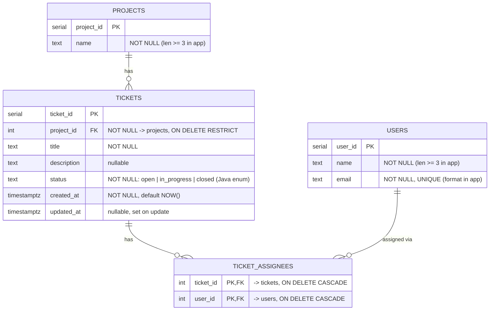

# ER Diagram — Ticket Tracking System

```mermaid
erDiagram
    PROJECTS ||--o{ TICKETS : "has"
    TICKETS  ||--o{ TICKET_ASSIGNEES : "has"
    USERS    ||--o{ TICKET_ASSIGNEES : "assigned via"

    USERS {
        serial user_id PK
        text name "NOT NULL (len >= 3 in app)"
        text email "NOT NULL, UNIQUE (format in app)"
    }

    PROJECTS {
        serial project_id PK
        text name "NOT NULL (len >= 3 in app)"
    }

    TICKETS {
        serial ticket_id PK
        int project_id FK "NOT NULL -> projects, ON DELETE RESTRICT"
        text title "NOT NULL"
        text description "nullable"
        text status "NOT NULL: open | in_progress | closed (Java enum)"
        timestamptz created_at "NOT NULL, default NOW()"
        timestamptz updated_at "nullable, set on update"
    }

    TICKET_ASSIGNEES {
        int ticket_id PK, FK "-> tickets, ON DELETE CASCADE"
        int user_id PK, FK "-> users, ON DELETE CASCADE"
    }
```

